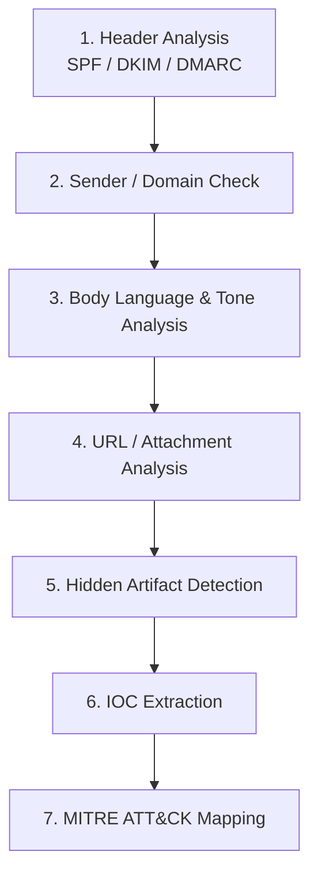

# Phishing Email Analysis

**A SOC-analyst-style phishing triage portfolio — 6 real-world email samples, each investigated end-to-end with full IOC extraction and MITRE ATT&CK mapping.**

All emails, links, and attachments referenced here are provided in th respective email folder.

## Objective

Email is still the single most common initial-access vector into an organization, and triaging a suspicious email quickly and correctly is a core SOC analyst responsibility. This repository exists to demonstrate that skill in practice: six real phishing emails, each investigated from raw headers to a defensible final verdict, using one consistent methodology.

Every write-up in this repository is built the way a SOC analyst would document a real triage, and touches the same skills:

- **Header forensics** — reading raw email headers and interpreting SPF, DKIM, and DMARC results, Authentication Results  correctly, including when a technically "clean" pass still doesn't mean the sender is trustworthy
- **Sender and domain investigation** — spotting typosquatting, homoglyph substitution, display-name spoofing, and domain mismatches across From, Reply-To, and Return-Path
- **Threat intelligence lookups** — Analyzing content language(fear,greed,quickAction), using tools like VirusTotal and EasyDMARC to independently verify domains, URLs, and file hashes rather than taking anything at face value
- **Hidden artifact analysis** — finding tracking pixels, malformed headers, and filter-evasion content designed specifically to not be seen
- **Structured reporting** — IOC tables and MITRE ATT&CK mapping on every case, in a format a SOC team could drop straight into a ticket or incident report

## Vision

The goal of this repository isn't just to label six emails "phishing" any spam filter can do that. It's to show the reasoning behind the verdict, case by case, so someone reviewing this repository can see exactly how a SOC analyst would work through a suspicious email from first glance to final classification. Each case was deliberately chosen to cover a different phishing technique, so the portfolio demonstrates range across the kinds of attacks a SOC analyst is likely to encounter, not repeated practice on one trick.

| Technique demonstrated | Case |
|---|---|
| Legitimate SaaS platform abused as a mail relay (passes SPF/DKIM/DMARC cleanly) | 01 |
| Domain Generation Algorithm (DGA) sending domain + aged-domain reuse | 02 |
| Real and fake links mixed in the same email to slip past a quick scan | 03 |
| Genuine personal Gmail account + encrypted PDF attachment to defeat AV scanning | 04 |
| Mail-merge personalization + disposable domain infrastructure | 05 |
| Reply-bait via `mailto:` links instead of a credential-harvesting redirect | 06 |

## Methodology

Every case follows the same seven-step triage process, documented in full in [`Methodology/readme.md`](Methodology/readme.md):



**The core principle behind step 1:** a clean SPF/DKIM/DMARC pass proves the message came from infrastructure genuinely authorized by the sending domain it does not prove that sender is trustworthy. Cases 01 and 04 in this repository pass every authentication check and are still phishing, because the attacker rented a corner of legitimate infrastructure (a free Zendesk trial, a personal Gmail account) instead of spoofing anything.

## Case Studies

| # | Case | Verdict | Key Technique | MITRE ATT&CK |
|---|---|---|---|---|
| 01 | [SaaS-Relay Abuse (Zendesk / Trust Wallet)](Case-Studies/01-saas-relay-abuse-zendesk/) | Phishing | Passed SPF, DKIM, **and** DMARC — attacker used a free Zendesk trial subdomain as a legitimate mail relay | T1566.002, T1204.001, T1036.005, T1583.006 |
| 02 | [DGA Domain (PayPal "$90 Reward")](Case-Studies/02-PayPal-Email-Analysis/) | Phishing | Sending domain flagged by VirusTotal as algorithmically generated (DGA); aged-domain reuse on the phishing redirect | T1566.002, T1204.001, T1036.005, T1583.001, T1583.006 |
| 03 | [Facebook Login Attempt](Case-Studies/03-Facebook-Email-Analysis/) | Phishing | Mixed real/fake links — genuine facebook.com links alongside `mailto:` reply-traps in the same email | T1566.002, T1204.001, T1036.005, T1583.001, T1585.002 |
| 04 | [Banco do Brasil Gmail PDF Lure](Case-Studies/04-Banco-do-Brasil-Email-Analysis/) | Phishing | Passed SPF, DKIM, and DMARC via a genuine Gmail account; malicious PDF deliberately encrypted to block AV/sandbox scanning | T1566.001, T1204.002, T1036.005, T1027.013, T1585.002 |
| 05 | [Life Line Screening Discount Package](Case-Studies/05-Life%20Line%20Screening-Email-Analysis/) | Phishing | Mail-merge subject-line trick and the highest spam-confidence score (SCL 9) in the set | T1566.002, T1204.001, T1036.005, T1583.001, T1583.006 |
| 06 | [Spoofed Sender (Microsoft Account Team)](Case-Studies/06-Microsoft-Email-Analysis/) | Phishing | Reply-bait via `mailto:` links instead of credential-harvesting redirects; tracking pixel confirmed by VirusTotal community as a known campaign | T1566.002, T1204.001, T1036.005, T1583.001 |

## Repository Structure

```
phishing-email-analysis/
├── README.md                          ← this file
├── Methodology/
│   └── readme.md                      ← the 7-step triage framework applied to every case
└── Case-Studies/
    ├── 01-saas-relay-abuse-zendesk/
    ├── 02-PayPal-Email-Analysis/
    ├── 03-Facebook-Email-Analysis/
    ├── 04-Banco-do-Brasil-Email-Analysis/
    ├── 05-Life Line Screening-Email-Analysis/
    └── 06-Microsoft-Email-Analysis/
        ├── README.md                  ← full write-up: headers, sender, body, links, hidden artifacts, IOCs, MITRE mapping
        ├── Eml File/                  ← defanged raw email for this case
        └── Screenshots/               ← tool evidence (VirusTotal, EasyDMARC, etc.)
```

## Disclaimer

These samples were collected for educational security-research purposes. This repository does not host any functional malware or live phishing infrastructure.
