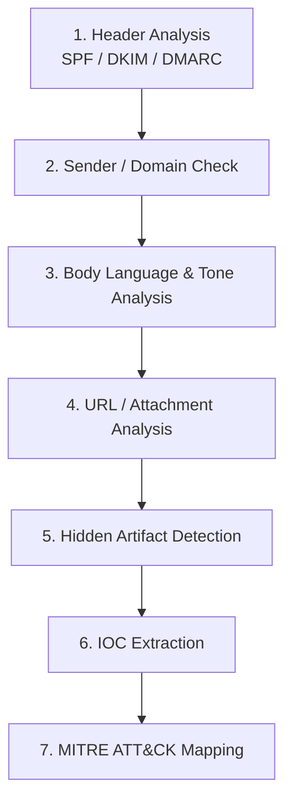

# Phishing Email Analysis

**6 real-world phishing samples · investigated end-to-end using a repeatable SOC-analyst triage framework · full IOC extraction and MITRE ATT&CK mapping on every case.**

All emails, links, and attachments referenced here are defanged (`hxxp`, brackets around dots) and any live malicious attachments have been withheld — only their file hashes are included. **Do not un-defang and visit these URLs or open these attachments.**

## Objective

Email remains the single most common initial-access vector into an organization, and triaging a suspicious email quickly and correctly is a core SOC analyst skill. This repository is a hands-on portfolio built to demonstrate that skill: six real phishing emails, each investigated from raw headers to final verdict using the same consistent methodology, so the process is repeatable and the findings are defensible — not just "this looks fake."

Each case covers a different technique on purpose, so the repository as a whole demonstrates breadth, not just repetition of one trick:

## Methodology

Every case follows the same seven-step triage flow, documented in full in [`docs/methodology.md`](docs/methodology.md):

| Technique demonstrated | Case |
|---|---|
| Legitimate SaaS platform abused as a mail relay (passes SPF/DKIM/DMARC cleanly) | 01 |
| Reply-bait via `mailto:` links instead of a credential-harvesting redirect | 02 |
| Domain Generation Algorithm (DGA) sending domain + aged-domain reuse | 03 |
| Real and fake links mixed in the same email to slip past a quick scan | 04 |
| Genuine personal Gmail account + encrypted PDF attachment to defeat AV scanning | 05 |
| Mail-merge personalization + disposable domain infrastructure | 06 |

**The core principle behind step 1:** a clean SPF/DKIM/DMARC pass proves the message came from infrastructure genuinely authorized by the sending domain — it does not prove that sender is trustworthy. Cases 01 and 05 in this repository pass every authentication check and are still phishing, because the attacker rented a corner of legitimate infrastructure (a free Zendesk trial, a personal Gmail account) instead of spoofing anything.

## Disclaimer

These samples were collected for educational security-research purposes. All content is defanged. This repository does not host any functional malware or live phishing infrastructure.
